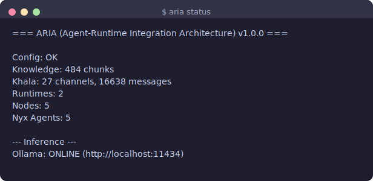
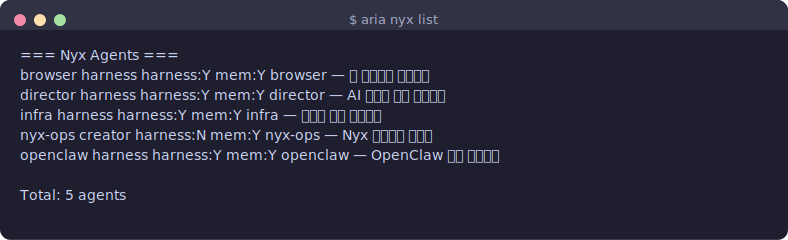
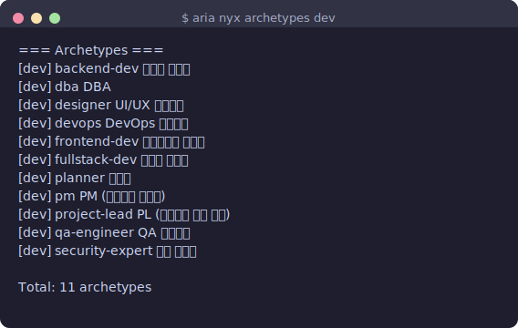
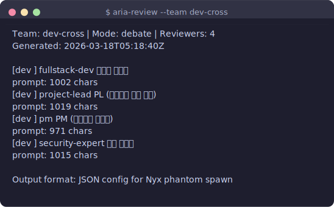

# ARIA — Agent-Runtime Integration Architecture

> **Documentation:** [English](README.md) | [한국어](docs/ko/README.ko.md)

## Screenshots

| | |
|---|---|
|  |  |
|  |  |

> Each runtime sings its own aria, together forming a single opera.

[](https://opensource.org/licenses/MIT)

ARIA is a unified orchestration layer that connects AI agents, runtimes, and tools under a single coherent structure. It provides **Nyx** for agent lifecycle management, **Khala** for inter-runtime messaging, a **Knowledge Bridge** for shared memory, and a **Registry** for runtime/node discovery.

ARIA does not replace your AI tools — it connects them.

---

## What is ARIA?

Modern AI workflows span multiple tools: Claude Code for implementation, OpenClaw as a gateway, Codex for code generation, local Ollama models for inference. Without coordination, these runtimes run in isolation — duplicating context, losing shared knowledge, and requiring manual handoffs between tools.

ARIA solves this by providing:

- **A shared agent layer (Nyx)** — persistent agents with memory, role definitions, and keyword-based routing
- **A messaging bus (Khala)** — JSONL append-only channels that cross runtime boundaries
- **A knowledge base** — SQLite FTS5 store accessible to all agents and runtimes
- **A skill library** — 169 composable skills organized by runtime and domain
- **A runtime registry** — structured discovery of which tools and nodes are available

---

## Architecture Overview

```
┌─────────────────────────────────────────────────────────┐
│                    ARIA v1.0.0                          │
│                                                         │
│  ┌─────────┐ ┌─────────┐ ┌──────────┐ ┌─────────────┐  │
│  │  Nyx    │ │ Khala   │ │Knowledge │ │  Registry   │  │
│  │ Agents  │ │Messaging│ │  FTS5    │ │  Discovery  │  │
│  └────┬────┘ └────┬────┘ └────┬─────┘ └──────┬──────┘  │
│       │           │           │              │          │
│  ┌────▼───────────▼───────────▼──────────────▼───────┐  │
│  │              Skills Library (169)                  │  │
│  └───────────────────────┬───────────────────────────┘  │
│                          │                              │
│  ┌───────────────────────▼───────────────────────────┐  │
│  │              Runtimes                             │  │
│  │  OpenClaw [ON]  Claude Code [ON]  Codex  Cursor   │  │
│  └───────────────────────────────────────────────────┘  │
└─────────────────────────────────────────────────────────┘
```

ARIA fits into a broader three-system stack:

```
AgentHive (WHAT)  →  ORBIT (WHEN)  →  ARIA (WHO/HOW)  →  Runtime (DO)
```

- **AgentHive** defines projects and tasks
- **ORBIT** scores and schedules them (R4 metrics)
- **ARIA** routes to the right agent and runtime
- **Runtime** executes (Claude Code, OpenClaw, etc.)

Each system is independently useful. See [docs/ECOSYSTEM.md](docs/ECOSYSTEM.md) for integration details.

---

## Quick Start

### Requirements

- bash 4+ (macOS: `brew install bash`)
- git

### Installation

```bash
git clone https://github.com/songblaq/aria.git
cd aria
./install.sh
export PATH="$HOME/.aria/bin:$PATH"
```

Add the `export` line to your `~/.zshrc` or `~/.bashrc` to make it permanent.

### Verify

```bash
aria status
```

Expected output:

```
=== ARIA (Agent-Runtime Integration Architecture) v1.0.0 ===

  Config:     OK
  Knowledge:  484 chunks
  Khala:      27 channels, 16638 messages
  Runtimes:   2
  Nodes:      5
  Nyx Agents: 5
```

---

## Key Components

### Nyx — Agent Orchestration

Nyx manages persistent AI agents. Each agent has a defined role, memory, and optional harness (domain context files). Tasks are routed to agents via keyword matching.

```bash
$ aria nyx list

=== Nyx Agents ===
  browser     harness  harness:Y mem:Y  browser — Web interaction agent
  director    harness  harness:Y mem:Y  director — AI media generation
  infra       harness  harness:Y mem:Y  infra — Infrastructure management
  nyx-ops     creator  harness:N mem:Y  nyx-ops — Agent meta-management
  openclaw    harness  harness:Y mem:Y  openclaw — Runtime operations

  Total: 5 agents
```

#### Agent types

| Type | Description | Harness | Memory |
|------|-------------|---------|--------|
| **harness** | Wraps external tools (SSH, APIs, ComfyUI) | Yes | Yes |
| **pure** | LLM-prompt only, no external tooling | No | Yes |
| **creator** | Can spawn and manage other agents | Optional | Yes |
| **phantom** | Ephemeral review persona — destroyed after use | No | No |

#### Self-reference bootstrap pattern

Every persistent agent receives its own `AGENT.md` path in the prompt. On activation it reads:

1. `~/.aria/agents/{id}/AGENT.md` — role and principles
2. `~/.aria/agents/{id}/config.json` — skills and routing keywords
3. `~/.aria/agents/{id}/harness/` — domain context (if present)
4. `~/.aria/agents/{id}/memory/context.md` — accumulated learning (100-line cap)

This self-reference pattern means agents adapt as their memory and harness files evolve — no redeployment required.

#### Agent memory lifecycle

Agent memory grows via append-only entries under dated headers. When it exceeds 100 lines:

- Oldest entries are summarized and removed
- Failure patterns and config changes are preserved
- Routine execution logs are pruned first
- Knowledge referenced 3+ times is promoted to `~/.aria/knowledge/`

---

### Khala — Inter-Runtime Messaging

Khala is an append-only JSONL pub-sub bus. Every channel is a file — simple, portable, and greppable.

```bash
$ aria khala list

=== Khala Channels ===
  global/alerts          215 msgs
  global/heartbeats    16122 msgs
  global/knowledge         9 msgs
  global/tasks            72 msgs
  dev-team/inbox           0 msgs
  ...
```

```bash
# Publish a message
aria khala publish global/tasks "API build task ready"

# Read recent messages
aria khala tail global/tasks 5
```

Khala crosses runtime boundaries — an OpenClaw cron job can publish to a channel that a Claude Code session reads, without any shared process or network service.

---

### Knowledge Bridge

A SQLite FTS5 store shared across all agents and runtimes. Supports full-text search, scoped storage by topic/project/infra, and direct publish to Khala.

```bash
$ aria knowledge search "agent routing"     # Full-text search
$ aria knowledge store "New insight..."     # Store knowledge
$ aria knowledge stats                      # Database statistics
```

Current corpus: **484 chunks** across system design, agent patterns, infrastructure notes, and project-specific knowledge.

---

### Review Archetypes — Phantom Panels

Assemble multi-perspective review panels from 34 phantom archetypes across 4 categories. Phantoms are ephemeral — they produce structured JSON findings and are discarded.

```bash
$ aria nyx archetypes dev

=== Archetypes ===
  [dev]  backend-dev      Backend Developer
  [dev]  dba              DBA
  [dev]  designer         UI/UX Designer
  [dev]  devops           DevOps Engineer
  [dev]  frontend-dev     Frontend Developer
  [dev]  fullstack-dev    Fullstack Developer
  [dev]  planner          Product Planner
  [dev]  pm               Project Manager
  [dev]  project-lead     Technical Lead
  [dev]  qa-engineer      QA Engineer
  [dev]  security-expert  Security Expert

  Total: 11 archetypes
```

Categories: `dev` (11), `art` (9), `persona` (8), `expert` (6)

#### Team presets

```bash
$ aria nyx teams

=== Team Presets ===
  dev-full       Full Dev Team Review    [parallel]    planner, designer, frontend-dev, ...
  dev-cross      Cross-Check Team        [debate]      fullstack-dev, project-lead, pm, ...
  art-creative   Creative Audit          [round-robin] painter, composer, sculptor, ...
  holistic       Holistic Review         [debate]      fullstack-dev, composer, persona, professor
```

#### Review modes

| Mode | How it works |
|------|-------------|
| **parallel** | All reviewers run simultaneously, results synthesized after |
| **round-robin** | Sequential — each reviewer sees previous findings |
| **debate** | Round 1 (parallel) → Round 2 (cross-respond) → Round 3 if no consensus |

#### Review output example

```bash
$ aria-review --team dev-cross --target "Authentication module redesign"

{
  "team": "dev-cross",
  "mode": "debate",
  "reviewer_count": 4,
  "reviewers": [
    { "id": "fullstack-dev",   "name": "Fullstack Dev",   "category": "dev" },
    { "id": "project-lead",    "name": "Tech Lead",       "category": "dev" },
    { "id": "pm",              "name": "Project Manager", "category": "dev" },
    { "id": "security-expert", "name": "Security Expert", "category": "dev" }
  ]
}
```

Each reviewer returns structured JSON with `findings[]` (severity, location, observation, recommendation, confidence) and an overall `score/10`.

---

## Directory Structure

```
~/.aria/                          # ARIA home (app data)
├── config.json                   # Global configuration
├── bin/aria                      # CLI entrypoint
├── agents/                       # Nyx agent definitions
│   ├── agents.json               #   Registry manifest
│   └── {id}/                     #   Per-agent directory
│       ├── AGENT.md              #     Role, principles, skills
│       ├── config.json           #     Type, model_hint, routing keywords
│       ├── memory/context.md     #     Accumulated learning (100-line cap)
│       └── harness/              #     Domain context files (optional)
├── nyx/                          # Nyx core
│   ├── prompts/                  #   agent.md, spawn.md, phantom.md
│   ├── routing.json              #   Keyword → agent routing rules
│   └── README.md                 #   Nyx documentation
├── khala/                        # Inter-runtime messaging
│   ├── channels/                 #   JSONL message channels
│   └── lib/khala-gc.sh           #   TTL-based message cleanup
├── knowledge/                    # FTS5 knowledge base
│   └── main.sqlite               #   SQLite with FTS5 index
├── registry/                     # Runtime and node metadata
│   ├── runtimes/                 #   Per-runtime JSON descriptors
│   └── nodes/                    #   Per-node JSON descriptors
├── profiles/                     # Shared profiles and archetypes
│   ├── SOUL.md                   #   System values and principles
│   ├── USER.md                   #   User preferences
│   ├── AGENTS.md                 #   Agent topology overview
│   ├── archetypes/{category}/    #   Phantom review personas
│   └── teams/presets.json        #   Team composition presets
├── skills/                       # Shared skill library (106 common)
└── runtimes/                     # Per-runtime adapters and skills
    ├── openclaw/skills/          #   39 OpenClaw-specific skills
    ├── claude-code/skills/       #   24 Claude Code skills
    ├── codex/                    #   Planned
    └── cursor/                   #   Planned
```

The project repository (`~/projects/aria/`) contains source and examples. `~/.aria/` is the live app data directory created by `install.sh`.

---

## Creating an Agent

### 1. Define the agent directory

```bash
mkdir -p ~/.aria/agents/my-agent/{memory,harness}
```

### 2. Write AGENT.md

```markdown
# my-agent

## Role
[Describe what this agent does]

## Principles
- [Core operating principle 1]
- [Core operating principle 2]

## Skills
- [Skill or domain this agent handles]
```

### 3. Write config.json

```json
{
  "type": "harness",
  "domain": "my-domain",
  "model_hint": "sonnet",
  "runtime_affinity": null,
  "node_binding": null,
  "skills": ["my-skill-*"],
  "routing_keywords": ["my-keyword", "my-domain"],
  "harness_files": ["harness/context.md"]
}
```

`type` options: `harness`, `pure`, `creator`
`model_hint` options: `haiku`, `sonnet`, `opus`

### 4. Initialize memory

```bash
echo "# my-agent memory\n\nInitialized $(date +%Y-%m-%d)" \
  > ~/.aria/agents/my-agent/memory/context.md
```

### 5. Register in agents.json

```bash
# agents.json is the registry manifest — add your agent entry:
# { "id": "my-agent", "type": "harness", "domain": "my-domain", "description": "..." }
```

### 6. Verify

```bash
aria nyx info my-agent
```

---

## Routing Configuration

Edit `~/.aria/nyx/routing.json` to add routing rules for your agents:

```json
{
  "version": "1.0.0",
  "rules": [
    { "keywords": ["server", "infra", "health"],  "agent": "infra",   "priority": 2 },
    { "keywords": ["agent", "nyx", "skill"],       "agent": "nyx-ops", "priority": 1 },
    { "keywords": ["my-keyword", "my-domain"],     "agent": "my-agent","priority": 1 }
  ],
  "fallback": "nyx-ops",
  "min_score": 2
}
```

Rules: a task must match at least `min_score` keywords from a rule's `keywords` list to route to that agent. Higher `priority` wins when multiple rules match.

---

## Khala Messaging

### Channel naming convention

```
{team}/inbox           # Team task queue
{team}/outbox          # Team results
global/tasks           # Cross-runtime task broadcast
global/alerts          # System alerts
global/heartbeats      # Runtime health pings
global/knowledge       # Knowledge update notifications
```

### Publishing from shell

```bash
aria khala publish dev-team/inbox "Review PR #42"
aria khala tail dev-team/inbox 10
```

### Publishing from a script

```bash
#!/usr/bin/env bash
CHANNEL="global/tasks"
MSG='{"type":"task","payload":"run health check","ts":"'$(date -u +%Y-%m-%dT%H:%M:%SZ)'"}'
aria khala publish "$CHANNEL" "$MSG"
```

### Message cleanup

Khala channels use TTL-based GC. Default TTL: 86400 seconds (24h). Run manually:

```bash
~/.aria/khala/lib/khala-gc.sh
```

---

## Runtime Integration

| Runtime | Type | Status | Integration |
|---------|------|--------|-------------|
| **OpenClaw** | gateway | Active | Nyx plugin (3 tools + CLI + prompt hook) |
| **Claude Code** | cli | Active | CLAUDE.md section + Agent tool |
| **Codex** | cli | Planned | Config ready |
| **Cursor** | ide | Planned | Config ready |

### Installing the Claude Code plugin

```bash
bash ~/projects/aria/plugins/claude-code/install.sh ~/.aria
```

This adds a `SKILL.md` to the Claude Code skills directory, enabling `aria` CLI access and Nyx agent routing from within Claude Code sessions.

### Installing the OpenClaw plugin

```bash
bash ~/projects/aria/plugins/openclaw/install.sh ~/.aria
```

Registers three OpenClaw tools: `nyx_spawn`, `nyx_list`, `nyx_status`.

---

## Phantom Archetypes Reference

34 archetypes across 4 categories:

| Category | Count | Examples |
|----------|-------|---------|
| `dev` | 11 | backend-dev, frontend-dev, devops, security-expert, qa-engineer |
| `art` | 9 | painter, composer, sculptor, photographer, writer |
| `persona` | 8 | professor, critic, skeptic, optimist |
| `expert` | 6 | domain specialists |

Archetypes are defined as Markdown files in `~/.aria/profiles/archetypes/{category}/`. Each file contains a profile, review focus areas, representative questions, and a system prompt.

To add a custom archetype:

```bash
# Create the file
cat > ~/.aria/profiles/archetypes/dev/my-expert.md << 'EOF'
# my-expert — My Domain Expert

## Profile
- **Category**: dev
- **Expertise**: [your domain]
- **Perspective**: [what angle this reviewer takes]

## Review Focus
- [Area 1]
- [Area 2]

## System Prompt
You are a [role description]. Review from [perspective].
EOF
```

---

## CLI Reference

```bash
# System
aria status                              # Health check — config, knowledge, khala, runtimes
aria version                             # Version info

# Nyx — Agents
aria nyx list                            # List all agents
aria nyx info <id>                       # Agent details (config, memory, harness)
aria nyx archetypes [category]           # List review archetypes
aria nyx teams                           # List team presets

# Khala — Messaging
aria khala list                          # List all channels with message counts
aria khala publish <channel> <message>   # Publish to a channel
aria khala tail <channel> [n]            # Show recent n messages (default: 20)

# Knowledge
aria knowledge search <query> [limit]    # Full-text search (default limit: 10)
aria knowledge store <text>              # Store new knowledge chunk
aria knowledge stats                     # Database statistics

# Registry
aria registry runtimes                   # List registered runtimes
aria registry nodes                      # List registered nodes
```

---

## Examples

The `examples/` directory contains public-safe templates to bootstrap your own setup:

```
examples/
├── agents/
│   └── example-agent.json        # Agent config.json template
├── archetypes/dev/               # 11 development role archetypes (full definitions)
├── teams/dev-presets.json        # Team preset configuration
├── nyx-prompts/
│   ├── agent.md                  # Persistent agent prompt template
│   ├── spawn.md                  # Anonymous worker prompt template
│   └── phantom.md                # Phantom review prompt template
├── config.example.json           # Global configuration template
└── routing.example.json          # Routing rules template
```

Start from `examples/config.example.json` when setting up a new environment.

---

## Ecosystem

ARIA works standalone and integrates with two companion tools:

| Tool | Purpose | GitHub |
|------|---------|--------|
| **AgentHive** | Project and task registry (WHAT) | [songblaq/agent-hive](https://github.com/songblaq/agent-hive) |
| **ORBIT** | R4 scoring scheduler (WHEN) | [songblaq/orbit](https://github.com/songblaq/orbit) |
| **ARIA** | Agent/runtime infrastructure (WHO/HOW) | [songblaq/aria](https://github.com/songblaq/aria) |

See [docs/ECOSYSTEM.md](docs/ECOSYSTEM.md) for the full integration guide, data flow, and FAQ.

---

## Contributing

Contributions welcome. Please open an issue first to discuss proposed changes.

See [docs/CONTRIBUTING.md](docs/CONTRIBUTING.md) for guidelines.

---

## License

MIT
